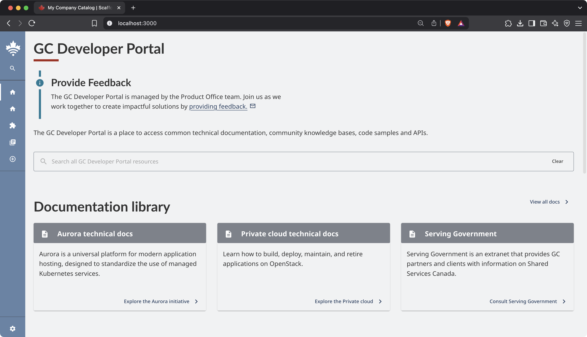

# GC Design System Backstage Variant

Backstage variant leveraging GC Design System.

This plugin brings the modern and accessible [GC Design System](https://design-system.alpha.canada.ca/) to your Backstage application.



## Setup

Install this plugin:

```shell
# From your Backstage root directory
git clone https://github.com/gccloudone/plugins-gcds-backstage plugins/
yarn --cwd packages/app add @gccloudone/plugin-gcds-backstage
```

## Theme installation

Please consult the patch that has been made against Backstage 1.38.1:

- [Patch against Backstage](./docs/gcds.patch)
